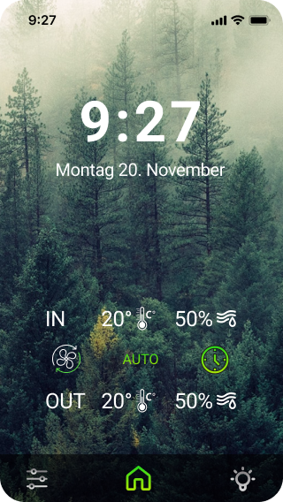
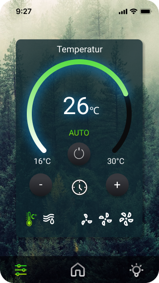
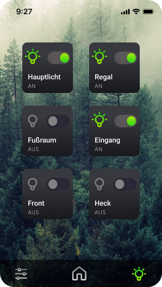
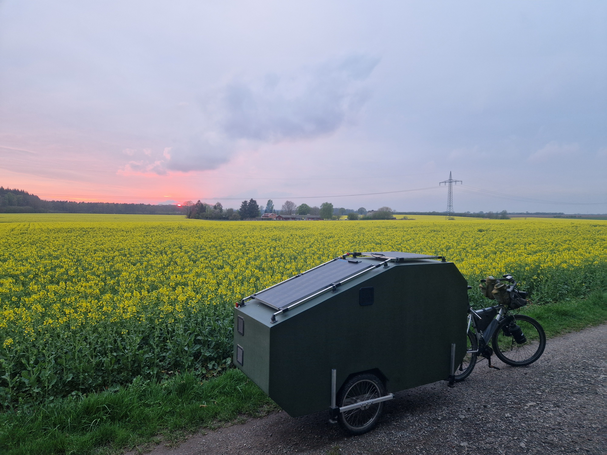
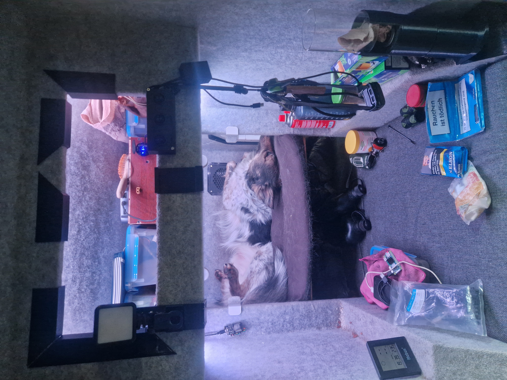
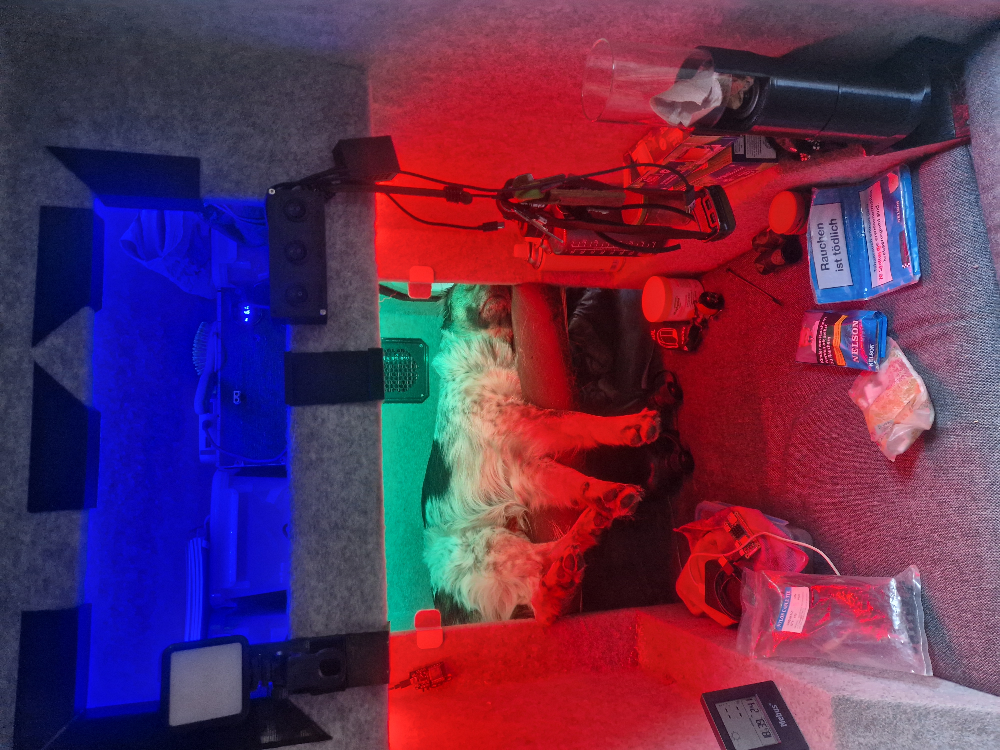
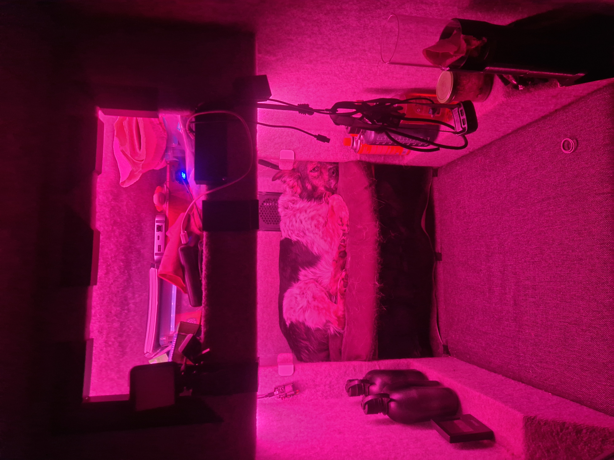

# Smart-Home System für Fahrradwohnwagen

## Projektübersicht

Das gesamte Projekt ist so konzipiert, dass es die Bedürfnisse eines Entwicklers, der gerne in der Natur ist, perfekt erfüllt und die Leidenschaft für IT und Development demonstriert. Die präzise und akribische Arbeitsweise, die ich mir in meiner früheren Tätigkeit in verschiedenen technischen Bereichen angeeignet habe, findet hier ihre direkte Fortsetzung.

Ein Raspberry Pi dient als zentraler Server, der nicht nur das hauseigene Smart-Home-System steuert, sondern auch als flexible Plattform für Development- und Testumgebungen dient.

Diese Umgebung wird durch ein Netzwerk von Microcontrollern wie ESP32/ESP8266 ergänzt, die als dezentrale Sensor- und Aktorknoten fungieren. Dies ermöglicht die Umsetzung eigener Software- und Hardware-Projekte direkt in der Natur.

Synergie von Technologie und Natur
Die Integration dieser IT-Umgebung in den Fahrradwohnwagen zeigt, wie moderne Technik genutzt werden kann, um eine völlig neue Dimension der Freiheit und Produktivität zu schaffen. Dank der autarken Energieversorgung kann das gesamte System jederzeit und überall betrieben werden. Damit wird der Fahrradohnwagen zum ultimativen Statement: Er verbindet Abenteuer mit digitaler Kreativität und beweist die Fähigkeit, komplexe, funktionale Systeme von Grund auf selbst zu entwickeln.

## Hardware-Komponenten

### Zentrale Steuereinheit

Raspberry Pi Zero W2: Dient als Hauptcontroller, der als MQTT-Broker und Web-Server fungiert, um die Kommunikation im gesamten System zu steuern und eine Benutzeroberfläche bereitzustellen.

Mikrocontroller und Peripherie
ESP32: Eingesetzt für komplexere Steuerungsaufgaben wie die Lichtsteuerung und das Management mehrerer Sensoren.

ESP8266: Verantwortlich für einfachere Sensoraufgaben, wie die Messung von Temperatur und Luftqualität.

BME280: Sensor für die genaue Erfassung von Temperatur, Luftfeuchtigkeit und Luftdruck.

SCD40: Spezieller Sensor zur CO2-Messung, um die Luftqualität im Innenraum zu überwachen.

WS2812 LEDs: Adressierbare RGB-LED-Streifen, die eine flexible und individuelle Beleuchtung in drei Zonen ermöglichen.

Noctua 5V PWM Lüfter: Sorgen für eine leise und effiziente Belüftungssteuerung.

Energieversorgung
Autarkes Lithium-Ionen-Batteriesystem: Ein selbstentwickeltes, modulares Energiesystem auf Basis von Lithium-Ionen-Zellen, das eine zuverlässige und unterbrechungsfreie Stromversorgung gewährleistet.

Effektive Solaranlage: Eine auf das System abgestimmte Solaranlage, die die Batterien mit nachhaltiger Sonnenenergie speist und somit eine vollständige Autarkie ermöglicht.

## APP Design

<table>
  <tr>
    <td></td>
    <td></td>
    <td></td>
  </tr>
</table>

### Web App

-   **Repository**: https://github.com/Lutz-Dietterich/fawowa-next-app
-   **Demo**: https://fawowa-next-app.vercel.app/

Siehe auch https://github.com/Lutz-Dietterich/fawowaControl
, ein früher Ansatz mit ESP32-gehostetem Webinterface. Aufgrund energetischer Vorteile wurde zuerst der das Hosting des Interfaces direkt vom ESP32 implementiert, aber aufgrund der begrenzten Leistung des ESP32, erfolgte später der Wechsel auf eine Raspberry-Pi-Infrastruktur.

## Fahrradwohnwagen

<table>
  <tr>
    <td></td>
    <td></td>
    <td></td>
  </tr>
</table>

### Konstruktion und Fertigung

Der Fahrradwohnwagen wurde als mehrschichtiger Verbundwerkstoff-Körper in GFK-Leichtbauweise entworfen. Dieses Composite-Verfahren ermöglicht eine extrem hohe Stabilität bei minimalem Gewicht, was für einen Fahrradwohnwagen entscheidend ist.

Die Proportionierung der gesamten Konstruktion basiert auf dem Goldenen Schnitt (Phi = 1,618), wodurch nicht nur eine harmonische Ästhetik, sondern auch optimale strukturelle Verhältnisse zwischen Länge, Breite und Höhe erreicht werden.

Die gesamte Konstruktion und Fertigung wurden vollständig eigenständig in eigener Werkstatt realisiert. Alle Komponenten, einschließlich der CNC-Präzisionsteile und komplexen Formteile, wurden selbst in CAD-Software designt und anschließend mit eigenen,zum teil selbst gebauten, Maschinen gefräst beziehungsweise mit 3D-Druck-Technologie gefertigt. Diese Autarkie im Design- und Fertigungsprozess gewährleistete eine durchgängige Qualitätskontrolle und eine präzise Umsetzung des Konzepts von der ersten Idee bis zum fertigen Produkt.

Eine integrierte Wärmedämmung macht den Wohnwagen zudem für verschiedene klimatische Bedingungen nutzbar und unterstreicht den hohen Anspruch an Funktionalität und Komfort.

## Solar System

<table>
  <tr>
    <td></td>
    <td></td>
    <td></td>
  </tr>
</table>

### Solar- und Energiesystem

Der Fahrradwohnwagen ist mit einem autarken 12V-Solarsystem mit einer Spitzenleistung von 150W ausgestattet. Dieses System ist darauf ausgelegt, auch bei minimaler Sonneneinstrahlung die grundlegenden Energiebedürfnisse zu decken. Mit den 150W Peak-Panels ist eine autarke Versorgung für gängige Verbraucher wie Smartphones, Internet-Hotspots und die Bordelektronik gewährleistet, sodass der Betrieb über rund 10 Tage ohne direkte Sonne sichergestellt ist.

### Vielseitigkeit, Effizienz und Überwachung

Die modulare Bauweise der Solarpaneele ermöglicht eine flexible Nutzung. Sie können so positioniert werden, dass sie auch bei einem im Schatten abgestellten Wagen immer perfekt zur Sonne ausgerichtet sind. Im Sommer wird stets genügend Energie erzeugt, um die Bordelektronik, das IT-System samt Server und Microcontroller sowie alle persönlichen Geräte zu versorgen.

Ein integriertes selbstentwickeltes Powerstation-System sorgt für maximale Zuverlässigkeit. Die modulare Bauweise der Powerstation schafft eine eingebaute Redundanz: Sollte ein Teil der Batterie ausfallen, bleibt das Gesamtsystem weiterhin voll funktionsfähig. Ein integriertes Batteriemanagementsystem (BMS) optimiert nicht nur die Lade- und Entladevorgänge des Akkus, sondern schützt ihn auch vor Überladung und Tiefentladung. Die Solaranlage ist zusätzlich mit einem Tracking-System ausgestattet, das eine detaillierte Überwachung der Solarleistung in Echtzeit ermöglicht. Dies sorgt für maximalen Überblick über den Energiefluss und die Effizienz des Systems. Darüber hinaus kann bei sonnigen Verhältnissen auch der Fahrradakku problemlos geladen werden. Diese hohe Effizienz stellt eine 100%ige Unabhängigkeit von externen Stromquellen sicher und unterstreicht die autarke Natur des Projekts.

## Licht Konzept

<table>
  <tr>
    <td></td>
    <td></td>
    <td></td>
  </tr>
</table>

### Beleuchtung und Lichtsteuerung

Das Beleuchtungssystem des Wohnwagens ist in drei individuelle Zonen aufgeteilt. Jede Zone wird mit adressierbaren LEDs realisiert, was eine präzise und flexible Lichtgestaltung ermöglicht.

Die Steuerung erfolgt primär über eine Tasmota-Schnittstelle und ein eigenes Web-Interface, das über einfache HTTP-Requests bedient wird. Diese Art der Steuerung gewährleistet maximale Kompatibilität mit verschiedenen Geräten und Systemen.

Für den Fall eines Totalausfalls des IT-Systems oder des Web-Interfaces ist die Funktionsfähigkeit der Beleuchtung durch eine redundante Steuerung gesichert: Analoge Schalter ermöglichen weiterhin die grundlegende Bedienung der Lichtanlage.

Für eine optimale Anpassung an jede Situation kann die Beleuchtung bei Bedarf sehr hell eingestellt werden. Gleichzeitig bietet das System auch eine rote Ambientebeleuchtung für die Nacht. Rotlicht hat nicht nur den entscheidenden Vorteil, dass es die natürliche Dunkeladaption des menschlichen Auges nicht beeinträchtigt, sondern bietet auch einen taktischen Nutzen: Die rote Beleuchtung ist aus der Ferne deutlich schwerer zu erkennen als weißes Licht, was die Sichtbarkeit des Wohnwagens bei Dunkelheit reduziert. Dies kann die Sicherheit erhöhen und ist besonders in der Wildnis von Vorteil. Die Sehkraft im Dunkeln bleibt erhalten, was nachts oder in der Dämmerung nützlich ist, um sich im Wohnwagen zu orientieren, ohne geblendet zu werden.

### Licht Steuerung

-   **Repository**: https://github.com/Lutz-Dietterich/led-website
-   **Technologie**: WS2812 adressierbare LED-Streifen
-   **Features**: Farb- und Helligkeitssteuerung, Effekte und Szenen

## Kontrollierte Wohnraumlüftung

### Funktionen

-   Kontinuierliche Messung der Luftqualität mit SCD40 (CO2) und BME280 (Temperatur, Luftfeuchtigkeit)
-   Automatische Steuerung der Noctua 5V PWM Lüfter basierend auf Messwerten
-   Energieeffiziente PWM-Regelung für optimale Lüftergeschwindigkeit

### Repositories

-   **Lüftersteuerung**: https://github.com/Lutz-Dietterich/FaWoWa_Fan
-   **Temperatur-/Luftfeuchtigkeitssensor**: https://github.com/Lutz-Dietterich/FaWoWa_Temp_Bme280

## ESP-Konfiguration

### Access Point Interface für WLAN-Konfiguration

-   **Repository**: https://github.com/Lutz-Dietterich/micropython_esp32-template
-   **Features**: MicroWebSrv mit Access Point für einfache WLAN-Konfiguration der ESP-Module
-   **Unterstützte Module**: ESP32 und ESP8266

## System-Funktionalitäten

### Umweltüberwachung

-   **Temperatur und Luftfeuchtigkeit**: BME280-Sensoren in verschiedenen Bereichen
-   **Luftqualität**: SCD40-Sensoren für CO2-Überwachung
-   **Luftdruck**: Zusätzliche Wetterinformationen über BME280

### Automatisierte Steuerung

-   **Intelligente Lüftung**: Automatische Anpassung der Noctua PWM-Lüfter basierend auf CO2-Werten
-   **Adaptive Beleuchtung**: WS2812 LED-Steuerung mit Szenen und Zeitplänen
-   **Energiemanagement**: Integration mit Solarsystem für optimierte Energienutzung

### Benutzeroberfläche

-   **Web-Dashboard**: Responsive Next.js-Anwendung
-   **Mobile Unterstützung**: Optimiert für Smartphone und Tablet
-   **Echtzeit-Updates**: MQTT-basierte Live-Datenübertragung

## Technische Architektur

### Kommunikation

-   **Protokoll**: MQTT für alle Geräte-zu-Gerät Kommunikation
-   **Broker**: Mosquitto auf Raspberry Pi Zero W2
-   **Netzwerk**: WLAN mit automatischer ESP-Konfiguration

### Software-Stack

-   **Zentrale**: Python mit MQTT-Client auf Raspberry Pi Zero W2
-   **ESPs**: MicroPython für ESP32/ESP8266
-   **Frontend**: Next.js Web-Anwendung
-   **Backend**: Node.js mit MQTT-Integration

## Implementierungsschritte

### 1. Hardware-Setup

-   Raspberry Pi Zero W2 Einrichtung mit Raspbian OS
-   MQTT-Broker (Mosquitto) Installation und Konfiguration
-   ESP32/ESP8266 Module mit Sensoren und Aktoren verbinden

### 2. Software-Entwicklung

-   MicroPython-Firmware auf ESP-Module flashen
-   MQTT-Kommunikation zwischen allen Komponenten etablieren
-   Web-Server und Dashboard auf Pi Zero W2 implementieren

### 3. Sensor-Integration

-   BME280-Sensoren für Umweltdaten kalibrieren
-   SCD40-Sensoren für CO2-Messung einrichten
-   Datenerfassung und -übertragung optimieren

### 4. Aktor-Steuerung

-   WS2812 LED-Streifen programmieren und testen
-   Noctua PWM-Lüfter Steuerung implementieren
-   Automatisierungslogik entwickeln

### 5. System-Integration

-   Alle Komponenten in das MQTT-Netzwerk integrieren
-   Web-Interface finalisieren und testen
-   Monitoring und Logging implementieren
